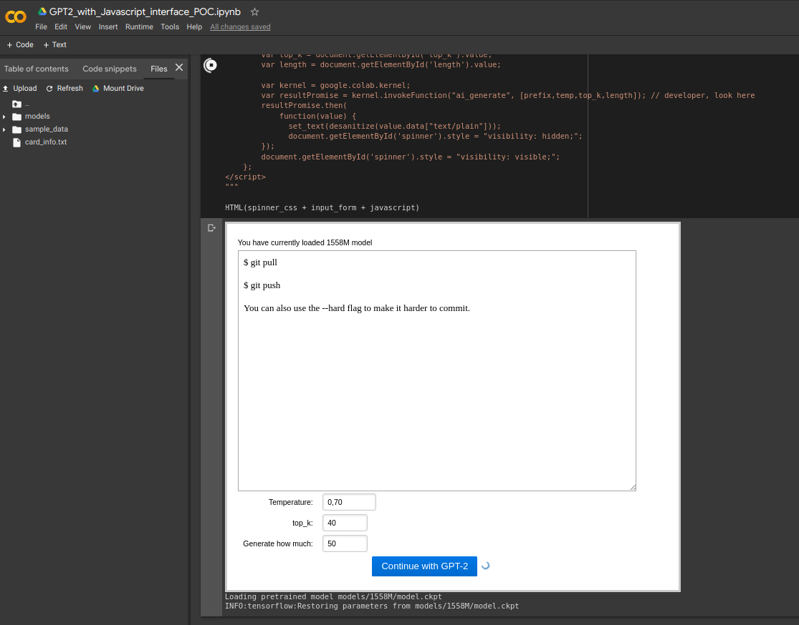

# gpt2colab-js
Make GPT-2 complete your text in Colab. Use fancy JS, instead of default ugly colab interface.
This is proof of concept for developers that want to create apps with graphics in Colab.

If you want to use this code as your playground check out [the 'multisample' branch](https://github.com/gpt2ent/gpt2colab-js/tree/multisample) for more useful notebooks.

